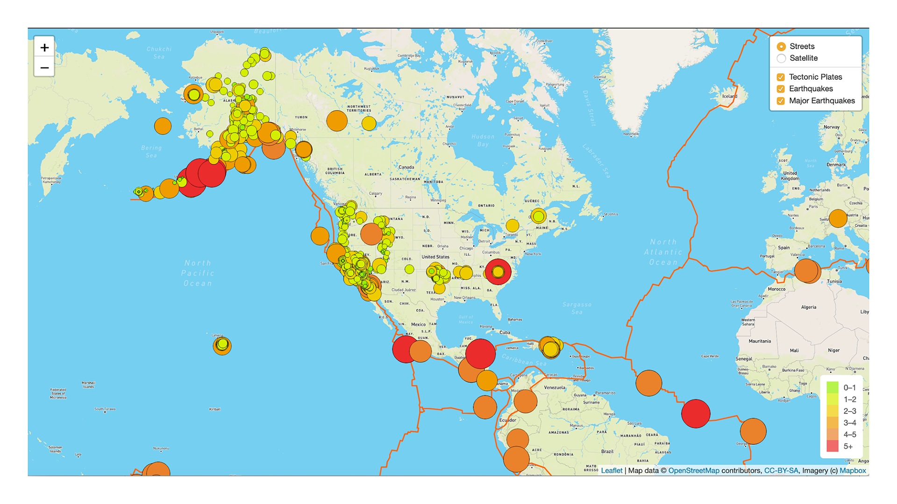

# Mapping_Earthquakes
- This project uses data provided by U.S.Geological Survey (usgs.gov) to show a visual repersentation of all of the earthquakes on the planet over the last 7 days.
- The final product is in the Earthquake_Challenge folder [Earthquake_Challenge]( https://github.com/pasmi369/Mapping_Earthquakes/tree/main/Earthquake_Challenge ).  

## Data Citation
- The Earthquake data is from [earthquake.usgs.gov](https://earthquake.usgs.gov/).
- Map API calls are processed from [Mapbox](https://www.mapbox.com/).
- [Leaflet](https://leafletjs.com/) is the JavaScript library used to format the API information.

## Overview
- The goal of the project was to create an interactive map showing earthquake data from the past 7 days. 
- This project was created using Javascript's Leaflet, D3 libraries and Mapbox's API, and GeoJson data from usgs.gov. 
- The JavaScript code is in the [Challenge_Logic.js](https://github.com/pasmi369/Mapping_Earthquakes/blob/main/Earthquake_Challenge/static/js/challenge_logic.js) file 
- The HTML code for the site is in the [Index.html](https://github.com/pasmi369/Mapping_Earthquakes/blob/main/Earthquake_Challenge/index.html) file.

## Results (Map Views)
- ### Streets View

- ### Satellite View

- ### Streets Major Earthquakes View

- ### Dark View

- ### Light View

